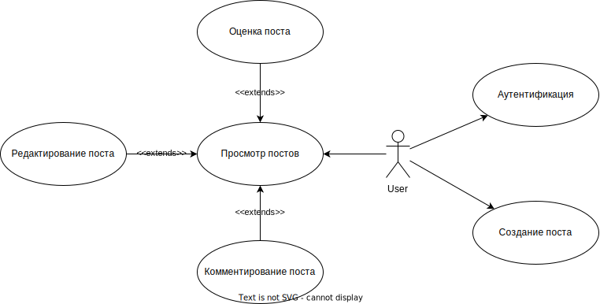

# ICS Network

Цель работы, решаемая проблема/предоставляемая возможность
Краткий перечень функциональных требований
Use-case диаграмма системы
BPMN диаграмма основных бизнес-процессов
Примеры описания основных пользовательских сценариев
ER-диаграмма сущностей
Диаграмма БД
Компонентная диаграмма системы
Экраны будущего web-приложения на уровне черновых эскизов. Задача данного упражнения - понять, как с приложением должен взаимодействовать пользовать для упрощения проектирования API. Это могут быть классические wireframes, черновики от руки, наброски в PAINT/псевдографике/Figma.

## 1. Цель работы

Упрощение коммуникации между студентами факультета ИУ. Каждый студент может поделиться опытом, знаниями, наработками, либо попросить совета сообщества, обладающего знаниями в предметной области.

## 2. Перечень функциональных требований

Пользователи должны иметь возможность оставлять посты, комментировать существующие посты и ставить им оценку (положительную или отрицательную).

## 3. Диаграмма прецедентов

## BPMN

## Основные пользовательские сценарии

## ER-диаграмма

## Диаграмма БД

## Компонентная диаграмма системы

## Экраны

## Сценарии

### Публикация поста

Пользователь попадает на главный экран, нажимает на иконку "пользователь" и попадает на экран прохождения аутентификации -> далее пользователь перенаправляется на главный экран, на котором нажимает "+" для добавления публикации -> заполняет поля публикации и нажимает "опубликовать"

### Просмотр комментариев к посту

Пользователь попадает на главный экран -> нажимает на интересующий его пост -> справа от содержимого поста пользователю представлены комментарии.
